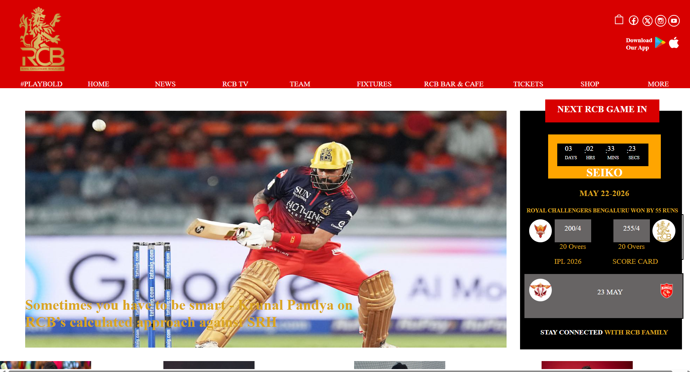

# 🏏 RCB Landing Page Clone

A responsive and visually appealing clone of the Royal Challengers Bengaluru (RCB) landing page built using HTML, CSS, and JavaScript.

## 🌐 Live Demo

https://praveenvivek.github.io/RCB-Landing-Page-Clone/

## 📖 About the Project

This project recreates the look and feel of the Royal Challengers Bengaluru website landing page. It focuses on responsive design, modern UI elements, and an engaging user experience.

## ✨ Features

- Responsive design for mobile, tablet, and desktop
- Modern and attractive user interface
- Smooth navigation
- RCB-inspired color theme and styling
- Fast-loading static website

## 🛠️ Built With

- HTML5
- CSS3
- JavaScript

## 🚀 Getting Started

### Clone the Repository

```bash
git clone https://github.com/your-username/RCB-Landing-Page-Clone.git
```

### Open the Project

1. Navigate to the project folder.
2. Open `index.html` in your browser.

## 📁 Project Structure

```text
RCB-Landing-Page-Clone/
│
├── index.html
├── style.css
├── script.js
├── assets/
│   ├── images/
│   └── icons/
└── README.md
```

## 📸 Screenshots



## 🎯 Learning Outcomes

Through this project, I practiced:

- Responsive web design
- CSS layouts and styling
- JavaScript interactivity
- Website cloning techniques
- Front-end development best practices

## 🤝 Contributing

Contributions, suggestions, and improvements are welcome.

1. Fork the repository
2. Create a feature branch
3. Commit your changes
4. Open a Pull Request

## 📄 License

This project is created for educational and portfolio purposes only.

## 👨‍💻 Author

**Praveen Vivek**

GitHub: https://github.com/praveenvivek

---

⭐ If you like this project, consider giving it a star on GitHub!
